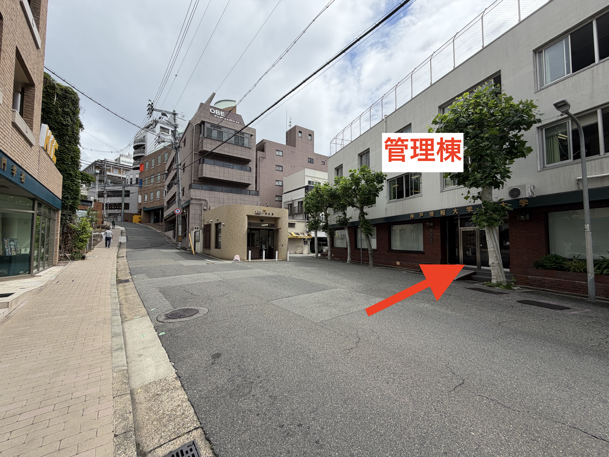
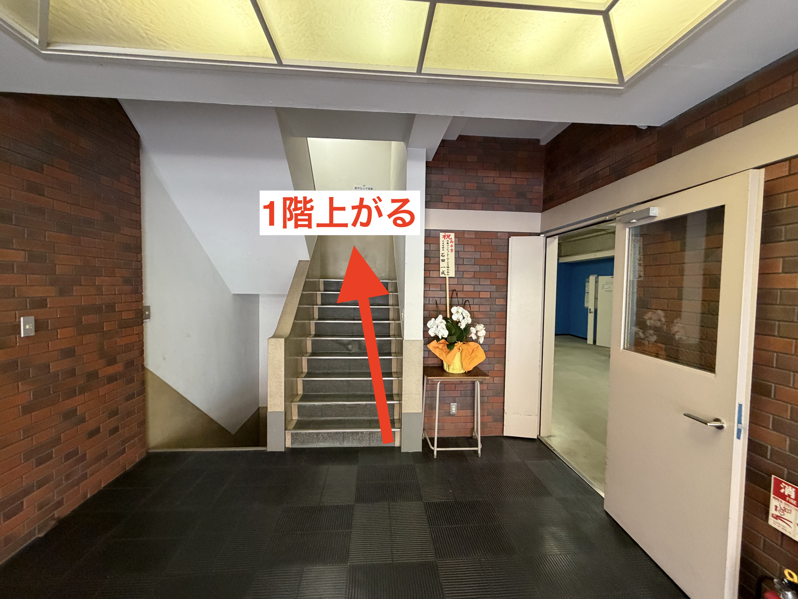
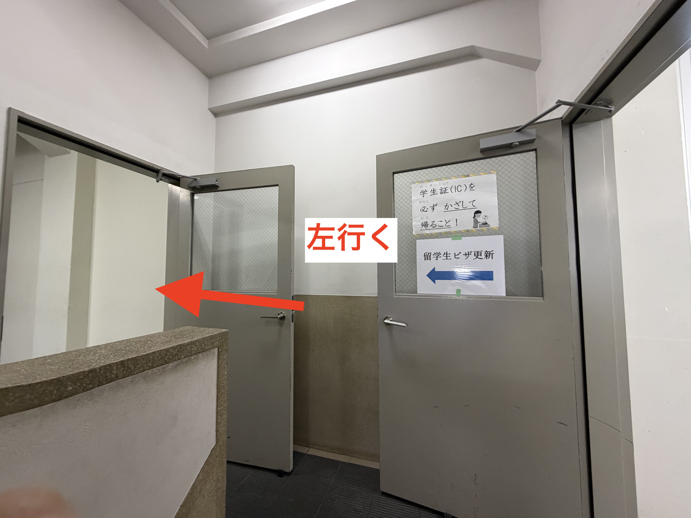
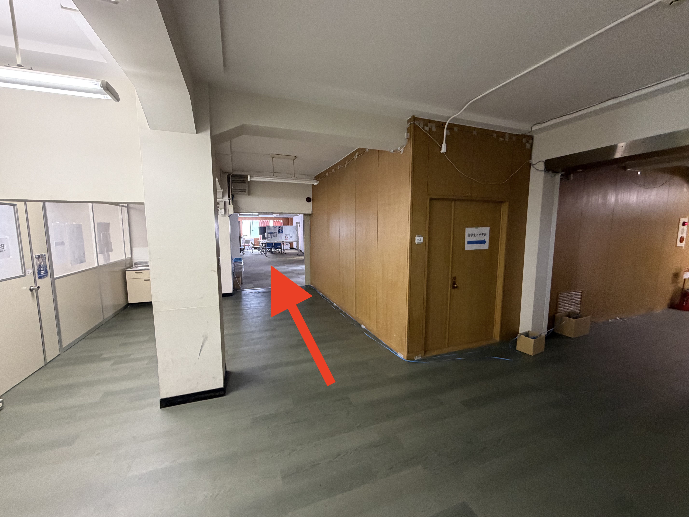
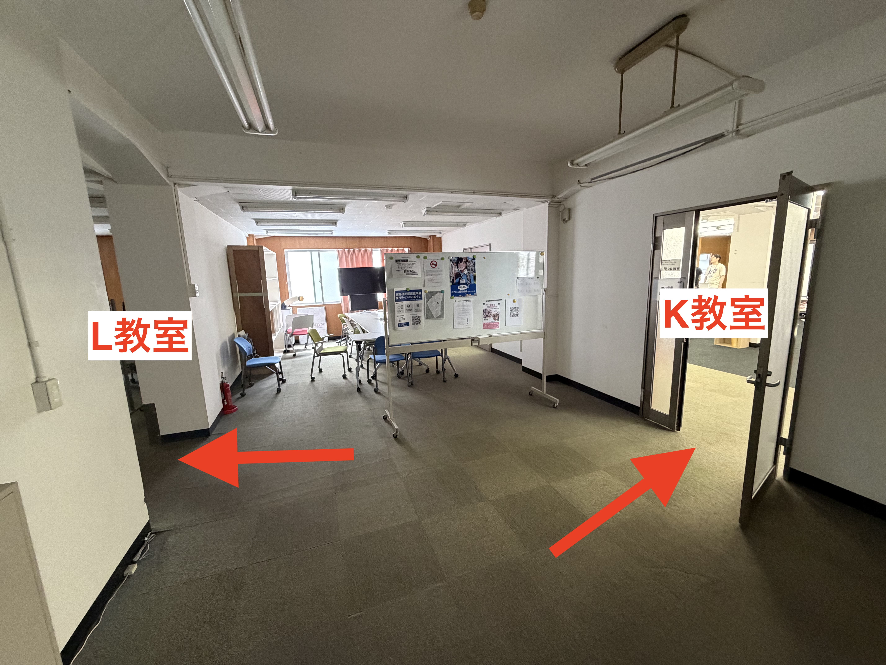

# 神戸電子専門学校 管理棟 K教室・L教室へのアクセス

We部の活動では、 **神戸電子専門学校 管理棟** の **K教室** または **L教室** を借りて利用することがあります。普段の校舎（本館）とは別の建物になるため、初めての方向けに入口から教室までの道順を写真付きで案内します。

## 所在地

| 項目     | 内容                                       |
| -------- | ------------------------------------------ |
| 学校名   | 神戸電子専門学校（管理棟）                 |
| 建物表示 | 「神戸情報大学」と書かれている建物         |
| 教室     | 管理棟 2階 K教室 / L教室                   |

!!! info "建物について"
    管理棟の入口には **「神戸情報大学大学院」** という表記がありますが、これが目印となる建物で間違いありません。

## 教室までの順路

### ① 交番前から管理棟へ

神戸電子専門学校の校舎前にある **交番** の前まで来ます。交番のすぐ右側にある建物が **管理棟** です。建物の壁面には「神戸情報大学大学院」と書かれています。正面の入口から建物に入ってください。

### ② 正面の階段を1階分上がる

建物に入るとすぐ正面に階段があります。この階段を **1階分** 上がってください（2階へ向かいます）。

### ③ 階段を上がりきったら左へ

階段を上がりきると正面と左右にドアが見えます。 **左方向** へ進んでください。

### ④ 廊下をまっすぐ進む

左へ曲がったあとは、廊下を **まっすぐ奥** へ進みます。突き当たりが開けたスペースになっています。

### ⑤ K教室・L教室に到着

開けたスペースに出ると、 **右手が K教室**、 **左手が L教室** です。当日の活動でどちらを使うかは事前の連絡を確認してください。

