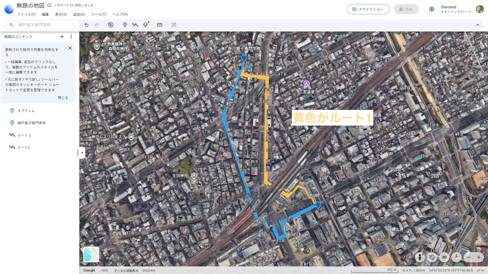
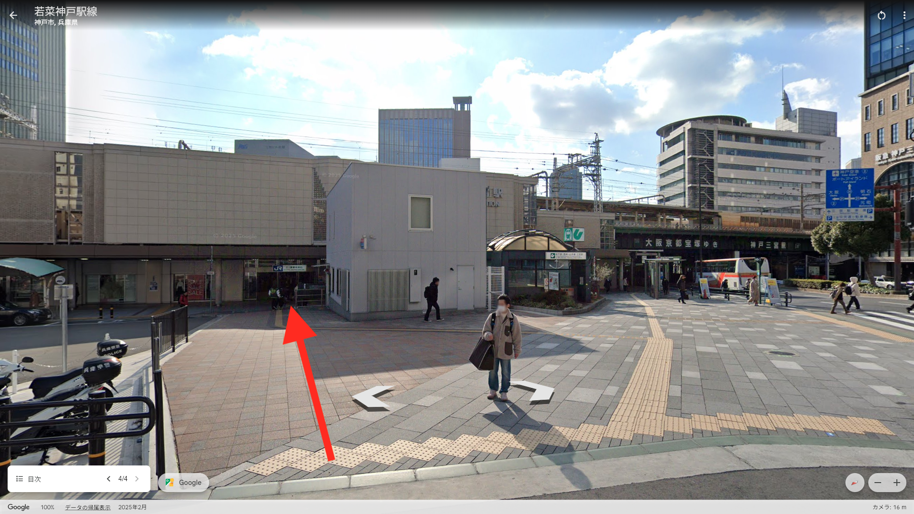
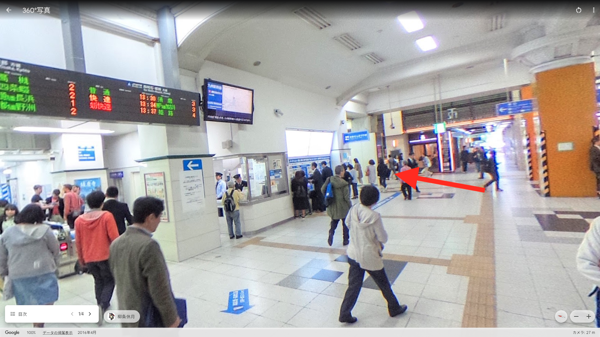
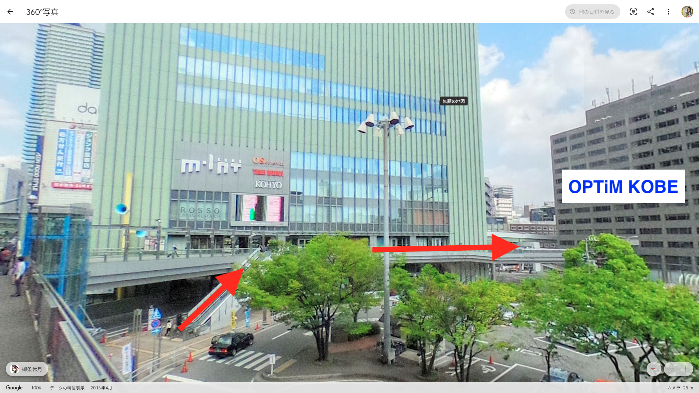
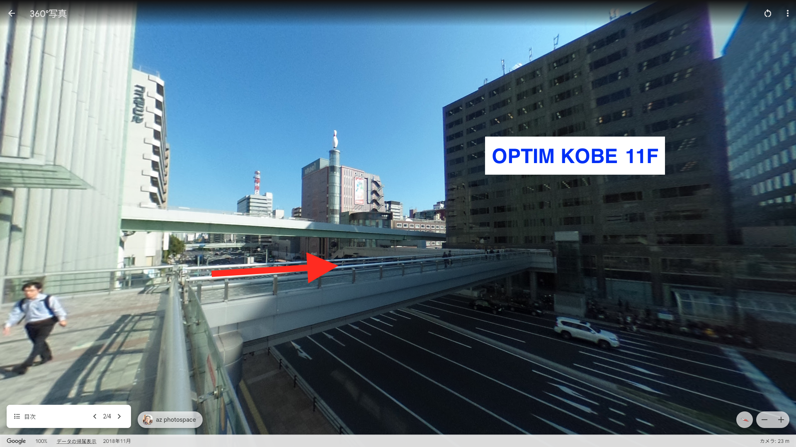

# オプティムワークスペースへのアクセス

第2回以降の活動で利用する、 **株式会社オプティム神戸拠点（OPTiM KOBE）** のワークスペースへのアクセス情報です。

## 所在地

| 項目   | 内容                                             |
| ------ | ------------------------------------------------ |
| 拠点名 | OPTiM KOBE                                       |
| 住所   | 〒651-0088 兵庫県神戸市中央区小野柄通7丁目1番1号 |
| ビル   | 日本生命三宮駅前ビル 11F                         |

## 最寄り駅

| 路線・駅                           | 出口                | 徒歩  |
| ---------------------------------- | ------------------- | ----- |
| 神戸市営地下鉄 西神・山手線 三宮駅 | 東出口3             | 約4分 |
| 阪神 神戸三宮駅                    | A19（さんちか）出口 | 約1分 |
| JR 三ノ宮駅                        | 中央口（南側）出口  | 約3分 |

## 公式ページ

詳細は株式会社オプティムの公式ページをご確認ください。

- [OPTiM KOBE 拠点情報（株式会社オプティム公式）](https://www.optim.co.jp/corporate/location/optim-kobe/)

## 神戸電子専門学校からのアクセス（ルート1）

神戸電子専門学校から OPTiM KOBE までの徒歩ルートを案内します。下の俯瞰図には2つのルートが描かれていますが、ここでは **黄色のルート1** を推奨ルートとして解説します（青のルート2は別経路）。

### ① JR三ノ宮駅前 — 交番の左脇を抜ける

JR三ノ宮駅前の大きな歩道に出ると、正面に **交番** があります。交番の **左脇** を抜けて、JRの改札方向へ進んでください。

### ② JR改札前を通過し、突き当たりを左折

JRの改札前をそのまま通り過ぎ、通路の **突き当たりを左** へ進みます。

### ③ ミント神戸の2階通路へ上がる

正面に **ミント神戸** が見えます。エスカレーターなどで **2階に上がり**、2階の連絡通路を渡って OPTiM KOBE 方面へ進んでください。

### ④ 目の前のビルが OPTiM KOBE

通路を抜けた先に見えるビルが **日本生命三宮駅前ビル（OPTiM KOBE が入居）** です。このビルに入り、11階のオプティムワークスペースへ向かってください。

## 会場利用にあたっての注意

隣室がオプティムのオフィスで、社員の方が業務をしています。 **大きな声・物音が出ないよう** ご配慮ください。詳しくは [活動場所・設備・PC のFAQ](../faq/活動場所・設備・PC.md) を参照してください。
