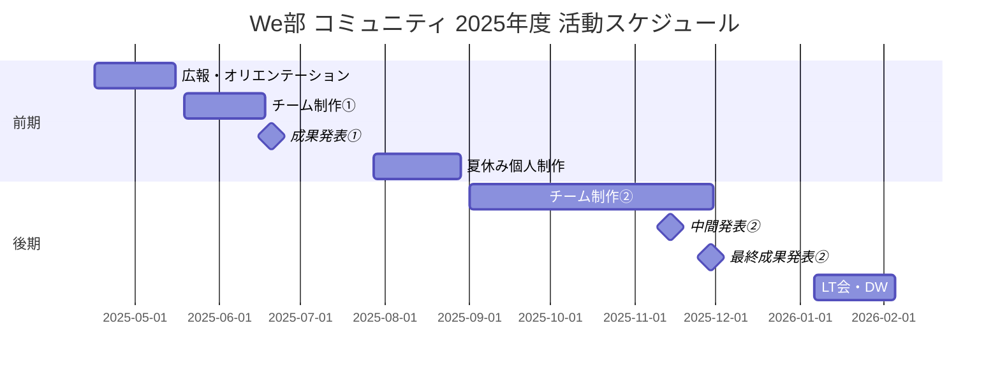

# 年間スケジュール

!!! note "このドキュメントについて"
    2025年度の神戸電子専門学校のスケジュールをベースにした仮の計画です。随時更新されます。

## 2025年度 We部 コミュニティ 年間スケジュール

### 前期（4月〜9月）

| 時期 | 日程 | 内容 |
|------|------|------|
| 前期授業開始 | 4月16日 | — |
| 広報期間 | 4月〜5月初旬 | 新入生への広報・勧誘 |
| GW | 5月2日〜6日 | — |
| オリエンテーション | 5月中旬 | GitHub・VSCode・Neovim 紹介、自己紹介、Windows 環境設定 |
| チーム分け・活動開始 | 5月中旬 | ご飯会、チーム決定 |
| デザインスプリント | 5月下旬（2週間・活動日1〜2日、検討中） | チーム制作①のアイデア出し・設計 |
| チーム制作① | 5月下旬〜6月中旬 | 第1回チーム制作（レンタルスペースでの開発も検討中）|
| 成果発表① | 6月中旬頃 | 第1回チーム制作の成果発表 |
| 前期授業中断（夏休み） | 7月28日〜8月28日 | — |
| 夏休み個人制作 | 夏休み期間中 | 各自での個人開発 |
| 夏休みオフラインイベント① | 夏休み期間中 | カンファレンス参加なども検討 |
| 授業再開 | 9月1日 | — |
| 個人開発成果発表会 | 9月上旬 | 夏休みの個人制作を共有 |
| チーム制作②開始 | 9月上旬 | 第2回チーム制作スタート |
| 前期通常授業終了 | 9月19日 | — |
| 前期末 HR | 9月26日 | — |

### 後期（10月〜3月）

| 時期 | 日程 | 内容 |
|------|------|------|
| 後期授業開始 | 10月6日 | — |
| 中間発表② | 11月中旬 | 第2回チーム制作の中間発表 |
| 学園祭 | 11月下旬 | — |
| 最終成果発表② | 11月29日（前日28日は午後休講） | 第2回チーム制作の最終発表 |
| 後期授業中断（冬休み） | 12月24日〜1月5日 | — |
| 授業再開 | 1月6日 | — |
| DW 振り返り・アウトプット共有会（LT 会） | 1月中旬 | 開発週間の振り返りと LT 発表 |
| DW（開発週間） | 1月29日 | — |
| 授業最終日 | 2月6日 | — |
| 1週間ハッカソン | 2月最終週（検討中） | 学年末の締めくくりとして検討中 |
| 成績発表・HR | 2月25日 | — |
| 卒業式（IT スペシャリスト） | 3月18日 | — |
| 終業日（IT エキスパート） | 3月19日 | — |

### 休暇・休講まとめ

| 休暇 | 期間 |
|------|------|
| GW | 5月2日〜6日（約5日間） |
| 夏休み | 7月28日〜8月28日（約1ヶ月） |
| 前後期の間 | 9月20日〜10月5日（約2週間） |
| 冬休み | 12月24日〜1月5日（約2週間） |

## 活動の大枠

