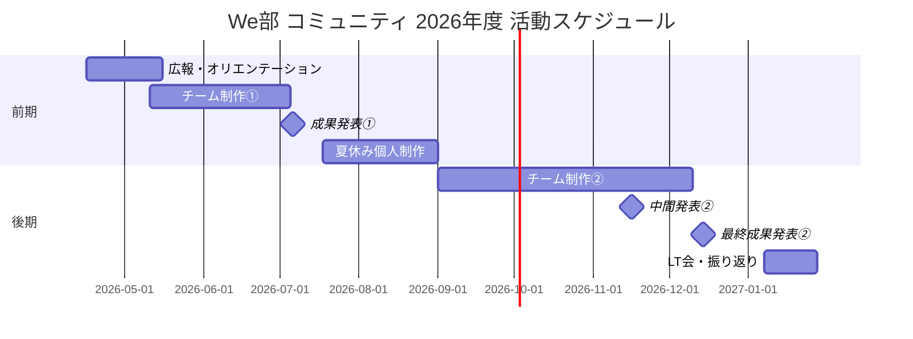

# 2026年度 We部 年間スケジュール（草案）

!!! note "このドキュメントについて"
    2026年度の神戸電子専門学校のスケジュールをベースにした計画です。随時更新されます。

## 前期（4月〜9月）

| 時期                 | 日程                   | 内容                                                     |
| -------------------- | ---------------------- | -------------------------------------------------------- |
| 広報期間             | 4月〜5月上旬           | 新入生への広報・勧誘                                     |
| 前期授業開始         | 4/16（木）             | —                                                        |
| GW                   | 4/29、5/3〜5/6         | 昭和の日・憲法記念日・みどりの日・こどもの日・振替休日   |
| オリエンテーション   | 5月上旬                | GitHub・VSCode 紹介、自己紹介、環境設定                  |
| チーム分け・活動開始 | 5月中旬                | ご飯会、チーム決定                                       |
| チーム制作①          | 5月中旬〜7月上旬       | 第1回チーム制作                                          |
| 成果発表①            | 7月上旬                | 第1回チーム制作の成果発表                                |
| 夏休み前最後の活動   | 7/17（金）             | —                                                        |
| 夏休み               | 7/18（土）〜8/31（月） | 各自での個人開発・カンファレンス参加など（取り組み自由） |
| 授業再開             | 9/1（火）              | —                                                        |
| 個人制作 成果共有    | 9月上旬                | 夏休みの個人制作を共有                                   |
| チーム制作②開始      | 9月上旬〜中旬          | 第2回チーム制作スタート                                  |
| 秋休み               | 9/19〜9/30             | —                                                        |

## 後期（10月〜2月）

| 時期                         | 日程                   | 内容                                      |
| ---------------------------- | ---------------------- | ----------------------------------------- |
| 後期授業開始                 | 10/1（木）             | —                                         |
| チーム制作②継続              | 10月〜11月             | —                                         |
| 中間発表②                    | 11月中旬               | 第2回チーム制作の中間発表                 |
| 学園祭                       | 11/21（土）            | 4年生確定出席・チーム展示あり             |
| 最終成果発表②                | 12月上旬〜中旬         | 第2回チーム制作の最終発表                 |
| 冬休み                       | 12/19（金）〜1/6（水） | —                                         |
| 授業再開                     | 1/7（木）              | —                                         |
| LT会・振り返り               | 1月中旬                | 活動の振り返りとアウトプット共有          |
| オープンソースカンファレンス | 1/30（土）             | 大阪（学校行事）                          |
| デジタルワークス             | 2/4（木）              | 神戸電子 学校全体の発表会（うはらホール） |
| 活動終了                     | 2月上旬                | —                                         |
| 春休み                       | 2/11（木）〜           | —                                         |

## 休暇まとめ

| 休暇   | 期間                                             |
| ------ | ------------------------------------------------ |
| GW     | 4/29、5/3〜5/6（昭和の日・憲法記念日〜振替休日） |
| 夏休み | 7/18〜8/31（約45日間）                           |
| 秋休み | 9/19〜9/30（約2週間）                            |
| 冬休み | 12/19〜1/6（約3週間）                            |
| 春休み | 2/11〜（建国記念日〜）                           |

## 活動の大枠

