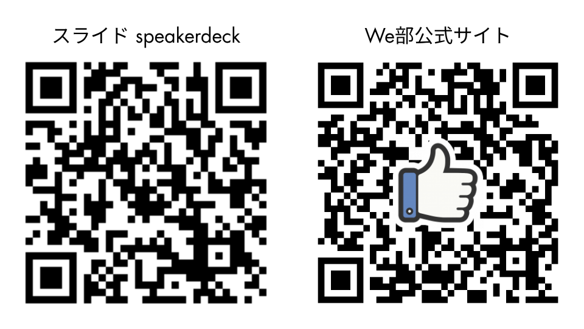
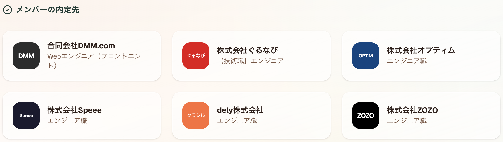

<!-- _class: title -->

# We部

## 神戸電子専門学校 非公式学生コミュニティ

2026年度 新入生向け紹介

---

<!-- _class: centered -->

---

# We部 ってなに？

神戸電子専門学校 **IT 系学科の学生** が集まる **非公式の学生コミュニティ** です。

- チーム制作を通して「作る楽しさ」を知る
- 仲間と考え、作り、形にする経験を積む
- **開発アルバイト挑戦や 優良企業への就職** に近づく力を身につける

> **エンジニアって楽しい** を共有するが We部 のテーマ。

---

<!-- _class: impact -->

# なぜ 開発アルバイト なのか

**お金をもらいながら、エンジニアとして働ける。**

学生のうちから 開発アルバイト に入ることで、
**実務経験 × 人脈 x 収入** が同時に手に入る。

開発バイトこそ最強のキャリア戦略

---

# こんな人に来てほしい

| 項目     | 内容                                           |
| -------- | ---------------------------------------------- |
| 対象     | 神戸電子専門学校 IT 系学科（主に 1・2 年生）   |
| 参加費   | **無料**                                       |
| 活動日   | 毎週 **木曜日**                                |
| 外部連携 | **株式会社オプティム**（OB・社員が見学・助言） |

**技術力より熱量・意欲** を大事にしています。初心者 OK ！

---

# 開発アルバイトの「強さ」

| 得られるもの | 中身                                                    |
| ------------ | ------------------------------------------------------- |
| **お金**     | 学生バイトの中でも **時給が高い**。学費・生活費にも効く |
| **実務経験** | 授業では触れられない **本物のコード・本物のチーム**     |
| **人脈**     | 現役エンジニア・先輩社員との **直接のつながり**         |
| **キャリア** | そのまま **内定** へつながることも                      |

> 「学びながら、稼ぎながら、次の扉が開く」— 学生の特権です。

---

<!-- _class: centered -->

---

# We部 のゴール

やりたいこと・目指していることです。

- 開発アルバイト挑戦や に近づく **チーム開発経験** を積む
- 「エンジニアって楽しい」と実感できる経験を増やす

---

# We部 がやらないこと(ノンゴール)

期待値をそろえるために、 **ノンゴール** も明示しています。

- プログラミング文法を **授業のように一から教える場** ではない
- 開発アルバイト選考への **直接ルートを保証する** 場ではない
- モバイル・ゲームなど **Web 系以外の分野** を主対象にはしない

---

# 主な活動 ①  チーム制作

**メイン活動**。年 2 回（前期・後期）、4〜6 人のチームで企画〜開発まで取り組みます。

- 実際に **作って動かす面白さ** を味わう
- **チーム開発の進め方** を学ぶ（Git / レビュー / タスク分担）
- 成果発表で **人に見せる経験** を積む

> 授業では得にくい「仲間とひとつのものを作り切る経験」が手に入ります。

---

# 主な活動 ②  LT 会・就職対策

## LT 会（不定期）

学んだこと・作ったものを気軽に共有する場。
**「こんなの作ったよ！」** と自慢しにきてください。

## 就職対策

開発アルバイト応募・Web 系就職に向けたサポート。
ドキュメントをベースに公開する予定です。

---

# 2026年度 年間スケジュール（前半）

| 時期             | 内容                                  |
| ---------------- | ------------------------------------- |
| 4〜5月上旬       | 広報・勧誘                            |
| 5月7日           | オリエンテーション（GitHub / VSCode） |
| 5月中旬          | **チーム分け・活動開始**              |
| 5月中旬〜7月上旬 | **チーム制作 ①**                      |
| 7月上旬          | 成果発表 ①                            |
| 7/18〜8/31       | 夏休み（各自で個人開発など）          |

---

# 2026年度 年間スケジュール（夏休み明け）

| 時期           | 内容                                  |
| -------------- | ------------------------------------- |
| 9月上旬〜      | **チーム制作 ②** スタート             |
| 11月中旬       | 中間発表 ②                            |
| 12月上旬〜中旬 | 最終成果発表 ②                        |
| 1月中旬        | LT 会・振り返り                       |
| 2/4            | デジタルワークス（神戸電子 全体発表） |

---

# 第1回活動のおしらせ

GW 明け最初の木曜

| 項目     | 内容                                   |
| -------- | -------------------------------------- |
| 日時     | **2026年5月7日（木）15:30〜17:00**     |
| 場所     | 神戸電子専門学校 **管理棟 2階 K 教室** |
| 参加予定 | 運営含むメンバー全員（約 20 名）       |

> 交番の右手の **神戸情報大学院大学（管理棟）** の階段を上って 2 階 K 教室。

詳しくは[こちら](https://webu-kobedenshi.github.io/web-community-vault/schedule/2026%E5%B9%B4%E5%BA%A6%E7%AC%AC1%E5%9B%9E%E6%B4%BB%E5%8B%95/#_1)

---

# 第1回活動 タイムスケジュール

| 時間         | 内容                             |
| ------------ | -------------------------------- |
| 15:30〜15:50 | オリエンテーション               |
| 15:50〜16:10 | 自己紹介タイム                   |
| 16:10〜16:20 | チーム分け・年間スケジュール共有 |
| 16:20〜17:00 | ボードゲーム ???                 |

---

# 株式会社オプティム との連携

**2回目以降は、オフィスの隣で活動します。**

| 回        | 場所                                                  |
| --------- | ----------------------------------------------------- |
| 第1回     | 神戸電子専門学校 **管理棟 2階 K 教室**                |
| 第2回以降 | **株式会社オプティム ワークスペース**（オフィス隣接） |

**オプティム社員** — 現役プロから直接 **フィードバック** がもらえることも！？

> 授業でも独学でも手に入らない、We部 だけの環境。

---

# 初心者でも来ていいの？

**OK です。** 入部前の必須要件はありません。

ただ、あるとスムーズ：

- **Git の基本操作**
- `if` 文・`for` 文などのプログラミング基礎
- Web アプリケーションの仕組みのざっくり理解

> 足りない部分は **活動しながら身につけていけば OK** 。
> 必要なのは「やってみたい」という気持ちです。

---

# 参加方法

1. googleフォームから参加希望を送る
2. 1 週間以内に運営から連絡
3. Discord に招待 → 活動スタート

**申込リンク**

- 公式 Web サイト <https://v0-ai-beta-khaki.vercel.app/>
- [参加申込フォーム（Google フォーム）](https://docs.google.com/forms/d/e/1FAIpQLSe7OkkLIouK8q6D9doWbvVApyKHpb9BIXULKz_I_i94VBfIsQ/viewform)

**直接声かけも歓迎**

- **橋本 怜苑** — 部長 / ソフト4
- **服部 潤一** — 副部長 / ソフト4

---

# 連絡・情報発信

| 用途               | ツール           |
| ------------------ | ---------------- |
| 告知・広報         | **X（Twitter）** |
| 活動中の連絡・交流 | **Discord**      |

@webudb

---

# 関連リンクまとめ

| リンク                        | URL                                                                                                   |
| ----------------------------- | ----------------------------------------------------------------------------------------------------- |
| 公式 Web サイト               | <https://v0-ai-beta-khaki.vercel.app/>                                                                |
| 参加申込フォーム              | <https://docs.google.com/forms/d/e/1FAIpQLSe7OkkLIouK8q6D9doWbvVApyKHpb9BIXULKz_I_i94VBfIsQ/viewform> |
| We部 ナレッジベース           | <https://junhat6.github.io/web-community-vault/>                                                      |
| NotebookLM（AI に質問できる） | <https://notebooklm.google.com/notebook/81622d4b-dbcb-4a6c-a2c1-19828092a7a8>                         |
| OBOG 掲示板                   | <https://webu-portal-web.vercel.app/>                                                                 |

> **NotebookLM** は、コミュニティに関する疑問を AI に聞ける場です。

---

<!-- _class: title -->

## まずは 5/7 に会いましょう

### 管理棟 2階 K 教室 / 15:30〜

**作る楽しさを、仲間と。**

申込は公式サイトから <https://v0-ai-beta-khaki.vercel.app/>
