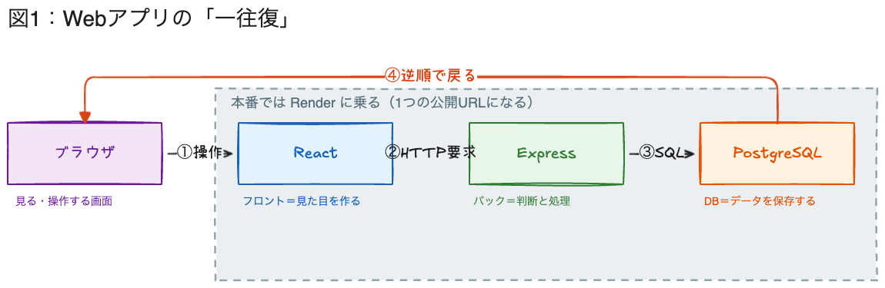
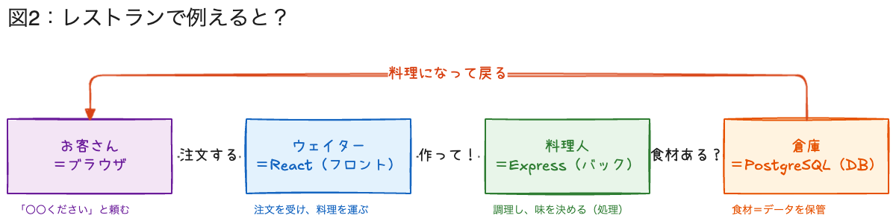
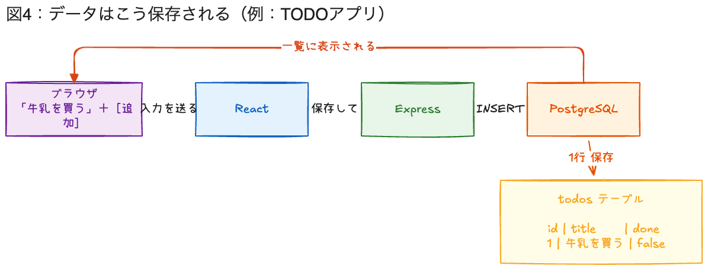
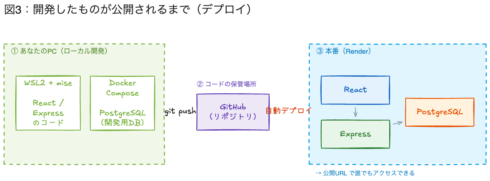

# 座学：Webアプリの仕組み（6/4・約25分）

> **目的**：「フロント／バック／DB／デプロイ」という言葉を、1本のストーリー（リクエストの一往復）で腹落ちさせる。
> **対象**：プログラミング初学者（C言語の if/for 程度）。
> **方針**：構文・コードは教えない。**仕組みの地図**だけ渡す。この後の「技術スタック紹介」と、宿題のPRD「技術構成／データ」欄が、この地図に全部つながる。
> **時間**：25分（導入2／一往復8／役割5／データ5／公開5）。

---

## 0. 導入（2分）

- 「デザインスプリントでアイデアは決まった。今日からは “それをどうやって動くWebアプリにするか” の地図を持ち帰ってもらう」
- 「**コードは1行も書きません**。今日のゴールは、`フロント` `バック` `データベース` `デプロイ` という4つの言葉が、どう繋がっているかが分かること。これが分かると、この後のスタックの話も、宿題のPRDも、全部読めるようになる」

---

## 1. Webアプリは「一往復」でできている（8分）

**話すこと：**

- 「Webアプリで起きていることは、結局 **“お願いして、返ってくる” の一往復** だけです。これが全ての基本」
- 左から順に、登場人物は4人：
    - **ブラウザ**：あなたが見て、操作する画面（Chrome や Safari）。
    - **React（フロント）**：見た目を作る担当。ボタンや一覧など “目に見える部分”。
    - **Express（バック）**：判断・処理する担当。「保存していいか」「誰のデータか」などを考える。**目に見えない**。
    - **PostgreSQL（DB）**：データを保存する担当。閉じても消えない “倉庫”。
- 矢印を①→②→③と指でなぞりながら：「①画面を操作すると、②フロントがバックにHTTPで“お願い”を送り、③バックがDBに問い合わせる」
- そして赤い矢印（④）：「**結果は来た道を逆に戻ってくる**。だから “一往復”。これだけです」
- 点線の枠：「この3つ（フロント・バック・DB）は、**本番では Render というサービスに乗せて、1つの公開URLになる**。後で詳しくやります」

> **つまずき対策**：「フロントとバックの違いが分からない」が初学者の最初の壁。**“見える＝フロント / 見えない＝バック”** と一言で握らせる。

---

## 2. 役割分担を「レストラン」で覚える（5分）

**話すこと：**

- 「さっきの4人を、レストランに例えると一発で覚えられます」
    - **お客さん＝ブラウザ**：「〇〇ください」と頼む（あなた）。
    - **ウェイター＝React（フロント）**：注文を受けて、料理を運ぶ。お客さんと直接やりとりする “顔”。
    - **料理人＝Express（バック）**：実際に調理し、味を決める。お客さんからは見えない。
    - **倉庫＝PostgreSQL（DB）**：食材＝データを保管しておく場所。
- 「お客さんは厨房に直接入らないし、倉庫から勝手に食材を取らない。**必ずウェイター（フロント）越しに頼む**。Webアプリも同じで、ブラウザはDBを直接触らない。これがセキュリティの基本でもある」

> **狙い**：技術用語を “役割” に変換して、恐怖心を下げる。ここで笑いが取れると場が温まる。

---

## 3. データはこう保存される（5分）

**話すこと：**

- 「具体例で一往復をなぞります。TODOアプリで『牛乳を買う』を追加する、とします」
    - ブラウザで入力して［追加］→ React がそれを受け取り → Express に「保存して」と渡す → PostgreSQL に **1行 INSERT（追加）** される。
    - 保存されると、その結果が逆に戻って、**画面の一覧に「牛乳を買う」が表示される**。
- 右下の表に注目：「DBは要するに **表（テーブル）** です。Excelの表に近い。`todos` という表に、`id / title / done` という列があって、1件が1行」
- 「**PRDの宿題に『データ（ざっくり）』という欄があります。あれは “このアプリでどんな表が必要か” を考える欄**。今のTODOなら `todos` 表、みたいに書けばOK」

> **橋渡し**：ここでPRDの「データ」欄の意味が回収される。宿題が一気に書きやすくなる。

---

## 4. 作ったものが「公開」されるまで（5分）

**話すこと：**

- 「最後。作ったアプリを、世界中の人が見られる状態にすることを **デプロイ** と言います」
- 流れは3ステップ：
    1. **あなたのPC（ローカル開発）**：手元で書いて、手元で動かして確認する。DBも手元（Docker Compose）に置く。
    2. **GitHub**：書いたコードを置いておく “保管場所”。`git push` で送る。
    3. **本番（Render）**：GitHubの `main` にコードが入ると、**Renderが自動でデプロイ**して、公開URLになる。
- 「ローカルと本番で **同じ PostgreSQL** を使う。だから手元でも Docker Compose で Postgres を動かす。“手元で動いた＝本番でも動く” に近づけるため」
- 「**7/16のゴールは、この “公開URL” を点灯させて、実際に触ってもらうこと**。今日の地図のゴール地点が、そのまま発表のゴールです」

---

## 5. まとめ → 技術スタック紹介へ（締め）

- 今日の地図：**一往復（フロント→バック→DB→戻る）＋ 公開（ローカル→GitHub→Render）**。
- 「この “箱” に、次のパートで **具体的な道具の名前** を入れていきます。フロントに何を使う？バックは？——それが技術スタックの話です」
- そのまま **技術スタック紹介** へ。

---

### 配布・運用メモ（登壇者向け）

- 図は `materials/assets/` にPNGで保存済み。スライドに貼るか、この `.md` を画面共有してもOK。
- 25分はあくまで目安。**①一往復が一番大事**なので、押したら②④を削って①を死守する。
- 第3回の反省を踏まえ、開始時に「17:00までにここまで」と**口頭でタイムボックスを宣言**してから始める。
