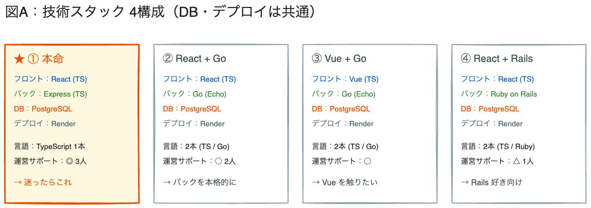
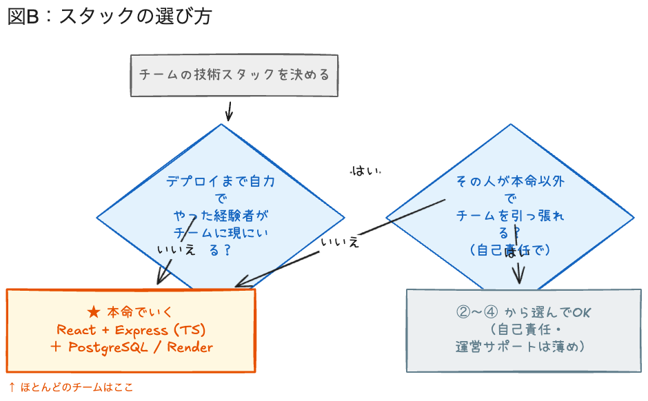

# 技術スタック紹介（6/4・約15分）

> **目的**：座学で作った「箱（フロント／バック／DB／デプロイ）」に、**具体的な道具の名前**を入れる。そのうえで **本命1本** を握らせ、チームに採否を持ち帰らせる。
> **前提**：直前の「Webアプリの仕組み 座学」を聞いた状態。
> **時間**：15分（導入1／4構成6／本命の理由3／選び方ルール4／締め1）。

---

## 0. 導入（1分）

- 「さっきの図で “箱” は分かった。フロントに React、バックに Express…という **道具の名前** を入れていきます」
- 「最初に大事なことを1つ。**紹介はたくさんするけど、運営の"推し（本命）"は1つだけ**です。理由も含めて話します」

---

## 1. 4つの構成を紹介（6分）

**話すこと：**

- 「まず共通点。**DBはPostgreSQL、デプロイはRender、どの構成でも同じ**。違うのは “フロントとバックに何を使うか” だけです」（←ここを最初に言うと混乱しない）
- 各構成を一言ずつ：
    - **① 本命：React + Express（TS）** … フロントもバックも **TypeScript 1本**。覚える言語が1つで済む。運営3人全員が助けられる。
    - **② React + Go** … バックを Go で本格的に。Goはバックエンドに強い言語。運営2人が対応可。
    - **③ Vue + Go** … フロントが React ではなく Vue。Vueも人気のフロント。
    - **④ React + Rails** … バックが Ruby on Rails。"作るのが速い" と人気のフレームワーク。
- 「②〜④も立派な選択肢。世の中の実務でも全部使われています。**ただし運営がどれだけ手厚く助けられるかが違う**（カードの『運営サポート』欄）」

> **注意**：ここで技術論争に深入りしない。「どれが優れているか」ではなく「**チームと運営にとってどれが現実的か**」の話だと枠を固定する。

---

## 2. なぜ「本命」が React + Express（TS）なのか（3分）

**話すこと（理由は3つ）：**

1. **言語が1本（TypeScript）**。初学者が6週間で締切に間に合わせるには、覚えることを減らすのが最優先。フロントとバックで言語が違うと、頭もAIへの指示も二重になる。
2. **AIと相性が最高**。AntiGravity / Gemini / Claude は React・Express の情報を大量に学習している＝**生成精度が高く、詰まりにくい**。今回はAIで作るのが前提なので、ここが効く。
3. **運営3人全員が助けられる**。締切間際にエラーで詰まったとき、**その場で救える人が一番多い**のがこの構成。

- 「つまり本命は “一番かっこいい” ではなく **“一番ちゃんと完成まで行ける”** で選んでいます。7/16に間に合わせるのが最優先だから」

---

## 3. じゃあどう選ぶ？（選び方ルール・4分）

**話すこと：**

- 「選び方はこのフローチャート1枚です」
- **質問1：デプロイまで自力でやった経験者が、チームに現にいる？**
    - **いいえ → 本命でいく。** これがほとんどのチーム。迷う必要なし。
    - **はい → 質問2へ。**
- **質問2：その経験者が、本命以外の構成で “自己責任で” チームを引っ張れる？**
    - **いいえ → 本命。**
    - **はい → ②〜④から選んでOK。** ただし **自己責任**。運営のサポートは薄くなる、と理解した上で。
- 「ここで正直に言います。**本命以外を選んだチームは、エラーで詰まっても運営がすぐ助けられないことがある**。それでも『自分たちで調べて進められる人がいる』なら、挑戦は歓迎です」

> **狙い**：自由選択の建前を残しつつ、実態としては大半を本命に寄せる。「経験者がいない＝本命」を即決させて、チームの意思決定を軽くする。

---

## 4. 締め（1分）＋ 宿題アナウンスへ

- 「今日はここまでで **チームごとに “本命でいくか・他を選ぶか” を決めて持ち帰って** ください。決めきれなければ本命でOK」
- 「次の『チーム制作の流れ』と宿題（PRD素案）に進みます」
- そのまま **チーム制作の流れ＋週次・宿題アナウンス** へ。

---

### 配布・運用メモ（登壇者向け）

- 図は `materials/assets/`（`stack-A-options.png` / `stack-B-howtochoose.png`）。
- ②〜④の具体名（Echo / Vue / Rails）は運営3人の得意分野に合わせた候補。**実際に救えるのは本命1本**という前提は崩さない。
- 「DB・デプロイは共通」を最初に言うのが事故防止の鍵。学生は4×全項目が違うと誤解しがち。
